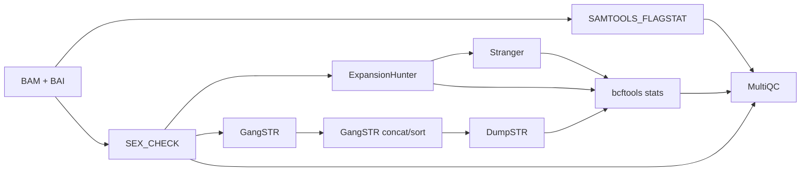

Weird-little-features-nf
===========

  - [Description](#description)
  - [Diagram](#diagram)
  - [How to cite this workflow](#how-to-cite-this-workflow)
  - [User guide](#user-guide)
      - [Quick start guide](#quick-start-guide)
      - [Install instructions](#install)
      - [Dependencies & third party tools](#dependencies--third-party-tools)
      - [Required (minimum) inputs/parameters](#required-minimum-inputsparameters)
      - [Recommendations for use on specific compute systems](#recommendations-for-use-on-specific-compute-systems)
      - [Benchmarking (compute resource usage on tested infrastructures)](#benchmarking-compute-resource-usage-on-tested-infrastructures)
  - [Additional notes](#additional-notes)
  - [Help/FAQ/Troubleshooting](#helpfaqtroubleshooting)
  - [3rd party Tutorials](#3rd-party-tutorials)
  - [Licence(s)](#licences)
  - [Acknowledgements/citations/credits](#acknowledgementscitationscredits)

---

## Description

Weird-little-features-nf is a Nextflow pipeline for repeat expansion genotyping and QC reporting from short-read Illumina BAM files.

Short tandem repeats (STRs) are short DNA motifs (typically 1–6 bp) repeated in tandem; expansion of certain STR loci beyond a normal size range causes over 50 known repeat expansion disorders, including Huntington's disease, myotonic dystrophy, and various spinocerebellar ataxias. Short-read sequencing struggles to span large expansions directly, so dedicated genotypers infer repeat length from indirect evidence in the aligned reads, spanning reads, flanking reads, and in-repeat reads, at each targeted locus. This pipeline uses two complementary genotypers to detect repeat expansions:

- **ExpansionHunter** takes a curated catalog of known disease-associated and polymorphic STR loci (coordinates + repeat unit) and genotypes them, making it well suited to targeted screening for known clinically relevant repeat
- **GangSTR** genotypes any STR loci listed in a region file/BED, giving broader (region-based) coverage, including loci with no established pathogenicity threshold. It needs its own QC step (TRTools `dumpSTR`) to separate reliable calls from noise.

For each sample, the pipeline:

1. Runs `samtools flagstat` on the BAM for basic alignment QC
2. Resolves the sample's sex from the samplesheet if given, otherwise infers it from the BAM via ngs-bits `SampleGender`
3. Genotypes short tandem repeats with ExpansionHunter (catalog-based) and/or GangSTR (region-based), using the resolved sex where relevant
4. QC-filters GangSTR's calls down to reliable expansion candidates with TRTools `dumpSTR`
5. Annotates ExpansionHunter's calls with pathogenicity/disease thresholds using Stranger
6. Summarises every VCF with `bcftools stats` and rolls all QC (flagstat, sex check, VCF stats) into a single MultiQC report

| Tool | Version | Purpose | Registry link |
|---|---|---|---|
| [samtools](https://github.com/samtools/samtools) | 1.24 | BAM alignment QC (`flagstat`); concatenating/sorting GangSTR's per-chromosome VCFs; per-VCF summary stats | [quay.io/biocontainers/samtools](https://quay.io/repository/biocontainers/samtools) |
| [ngs-bits `SampleGender`](https://github.com/imgag/ngs-bits) | 2025_12 | Infer sample sex from BAM coverage when not given in the samplesheet | [seqera.io/community.wave](https://community.wave.seqera.io/library/ngs-bits) |
| [ExpansionHunter](https://github.com/Illumina/ExpansionHunter) | 5.0.0 | Catalog-based STR genotyping | [quay.io/biocontainers/expansionhunter](https://quay.io/repository/biocontainers/expansionhunter) |
| [GangSTR](https://github.com/gymreklab/GangSTR) | 2.5.0 | Region-based STR genotyping | [quay.io/biocontainers/gangstr](https://quay.io/repository/biocontainers/gangstr) |
| [TRTools `dumpSTR`](https://trtools.readthedocs.io/en/stable/dumpSTR.html) | 6.1.0 | QC filtering of GangSTR calls down to reliable expansion candidates | [quay.io/biocontainers/trtools](https://quay.io/repository/biocontainers/trtools) |
| [Stranger](https://github.com/Clinical-Genomics/stranger) | 0.9.1 | STR pathogenicity/disease-threshold annotation | [seqera.io/community.wave](https://community.wave.seqera.io/library/stranger_tabix) |
| [MultiQC](https://multiqc.info/) | 1.35 | Aggregate QC report | [quay.io/biocontainers/multiqc](https://quay.io/repository/biocontainers/multiqc) |

## Diagram



## User guide for NCI Gadi HPC

### Quick start guide

Requirements:

- [Nextflow](https://www.nextflow.io/docs/latest/index.html) `>=24`
- Singularity
- A reference genome FASTA with a `.fai` index alongside it
- An ExpansionHunter STR catalog `.json` and/or a GangSTR STR region file (see [Required (minimum) inputs/parameters](#required-minimum-inputsparameters))

Clone the repository and run it directly:

```bash
git clone https://github.com/Sydney-Informatics-Hub/weird-little-features-nf.git
cd weird-little-features-nf
module load singularity nextflow
nextflow run main.nf --help
```

A pre-configured profile is provided for **NCI Gadi** (PBS Pro). Combine it with `singularity` on the `-profile` flag:

```bash
nextflow run main.nf \
  --input samplesheet.csv \
  --ref /path/to/reference.fa \
  --catalog /path/to/variant_catalog.json \
  -profile singularity,gadi \
  --gadi_account <NCI project code> \
  --gadi_storage gdata/<project>+scratch/<project>
```

Gadi-specific parameters:

| Parameter | Required | Default | Description |
|---|---|---|---|
| `--gadi_account` | yes (on `gadi`) | `$PROJECT` env var | NCI project code jobs are billed/charged to |
| `--gadi_storage` | yes (on `gadi`) | `scratch/$PROJECT` | Storage mount string passed to PBS (e.g. `gdata/er01+scratch/er01`) |

See NCI's [Nextflow on Gadi documentation](https://opus.nci.org.au/display/DAE/Nextflow) for general setup of Nextflow on this system.

**A `setonix` profile and a `test` profile are referenced in `nextflow.config` (`includeConfig "config/setonix.config"`, `includeConfig "config/test.config"`) but neither config file exists in this repository yet, and no `test_data/` directory is provided.** Selecting `-profile setonix` or `-profile test` will currently fail with a missing-file error. Until these are added, run on other infrastructure using the default [`config/standard.config`](config/standard.config) profile, or write your own infrastructure config following the [AustralianBioCommons infrastructure documentation guidelines](https://github.com/AustralianBioCommons/doc_guidelines/blob/master/infrastructure_optimisation.md).

Run `nextflow run main.nf --help` to see usage at the command line.

### Required (minimum) inputs/parameters

| Parameter | Required | Default | Description |
|---|---|---|---|
| `--input` | yes | – | Path to samplesheet CSV (see below) |
| `--ref` | yes | – | Reference genome FASTA (`.fai` must exist alongside it) |
| `--catalog` | yes* | – | ExpansionHunter variant catalog (JSON). Also used by Stranger for annotation, so it must match the ExpansionHunter build (see [Additional notes](#additional-notes)) |
| `--ref_str` | yes* | – | GangSTR STR region file (BED/TSV, uncompressed) |

`--catalog` and `--ref_str` are each individually optional, omitting one skips only the tools that depend on it (ExpansionHunter + Stranger, or GangSTR + DumpSTR, respectively), with a logged warning rather than a failure. At least one should normally be supplied, otherwise the pipeline only produces `samtools flagstat`/sex-check QC.

Other parameters:

| Parameter | Required | Default | Description |
|---|---|---|---|
| `--sexcheck_method` | no | `xy` | Method passed to ngs-bits `SampleGender` for samples with no usable `sex` in the samplesheet. One of `xy`, `hetx`, `cnv` — see the [ngs-bits documentation](https://github.com/imgag/ngs-bits) |
| `--outdir` | no | `results` | Output directory |

#### Samplesheet

CSV with the following columns:

| Column     | Required | Description |
|------------|----------|--------------|
| `sampleID` | yes      | Sample identifier, used to tag outputs |
| `bam`      | yes      | Path to the sample's BAM file |
| `sex`      | no       | `male`/`female` (also accepts `M`/`F`, `XX`/`XY`) |

```csv
sampleID,bam,sex
sample_01,/path/to/sample_01.bam,male
sample_02,/path/to/sample_02.bam,
```

**`sex` is optional per-sample.** Leave it blank (or omit values you don't know) and the pipeline will infer it via ngs-bits `SampleGender` before ExpansionHunter or GangSTR run. See [Sex resolution](#sex-resolution) below.

**The BAM's `.bai` index is not listed in the samplesheet.** It's located automatically next to each BAM, as either `<bam>.bai` or `<bam base>.bai`. The pipeline fails fast at input parsing if neither is found.

#### Sex resolution

ExpansionHunter's genotyping of X-linked repeats depends on sample sex, so every sample needs one resolved *before* any repeat expansion module runs:

- If the samplesheet provides a recognised value (`male`/`female`, `M`/`F`, `XX`/`XY`), it's used directly.
- Otherwise, `ngs-bits SampleGender` is run on the BAM to infer it from X/Y coverage.
- If detection is inconclusive, the sample defaults to `male` (ExpansionHunter's own default) and a warning is logged.

The resolved sex is passed to ExpansionHunter as `--sex`. GangSTR and Stranger do not currently take sex into account (see [Additional notes](#additional-notes)). The per-sample `ngs-bits` result is also fed into the MultiQC report so inferred sex calls can be spot-checked.

#### Repeat expansion genotyping

**ExpansionHunter** genotypes the loci defined in `--catalog` directly, producing one VCF per sample. Its output is passed straight to Stranger for annotation.

**GangSTR + DumpSTR.** GangSTR has no built-in multithreading, so it's scattered one chromosome per task (using the chromosomes listed in `--ref_str`) and the resulting per-chromosome VCFs are concatenated and coordinate-sorted back into a single per-sample VCF. That VCF is then passed through TRTools `dumpSTR`, applying its recommended "Level 1" QC filters (safe to apply regardless of repeat type/disease association):

- drop calls with a genotype spanning less than the full expected bounds (`--gangstr-filter-spanbound-only`)
- drop calls with a poor confidence interval (`--gangstr-filter-badCI`)
- enforce a call-level depth window of 10–1000× (`--gangstr-min-call-DP 10` / `--gangstr-max-call-DP 1000`)
- drop filtered records entirely rather than keeping them flagged (`--drop-filtered`)

The one recommended filter *not* applied is the segmental-duplication locus filter (`--filter-regions ... SEGDUP`), which needs a bgzipped/tabix-indexed BED of segmental duplications for the reference build in use — this pipeline doesn't currently supply one. The DumpSTR-filtered VCF (not the raw GangSTR output) is what gets published and fed into `bcftools stats`/MultiQC. Alongside the filtered VCF, DumpSTR also writes `.loclog.tab` and `.samplog.tab` — per-locus and per-sample filtering logs recording how many calls were dropped and why.

**Stranger** annotates ExpansionHunter's VCF with pathogenicity/disease thresholds, using the same `--catalog` JSON so repeat definitions match between genotyping and annotation:

- If the catalog already matches Stranger's expected flat schema (`NormalMax`/`PathologicMin` directly on each locus), it's used as-is
- If the catalog instead nests thresholds under a per-locus `Diseases` list (the common ExpansionHunter style), it's automatically reshaped into Stranger's flat schema first. Loci with more than one disease entry are split into one row per disease (`LocusId` suffixed `_1`, `_2`, ...), since Stranger only supports a single threshold pair per `LocusId`. Loci with no usable threshold data are dropped, since Stranger can't annotate them either way

This detection/conversion happens automatically — no parameter is needed to select it.

#### QC and reporting

- **`samtools flagstat`** runs on every input BAM, independent of sex check/genotyping.
- **`bcftools stats`** runs on every ExpansionHunter, DumpSTR-filtered GangSTR, and Stranger VCF.
- **MultiQC** aggregates the flagstat output, the ngs-bits sex-check TSVs, and all `bcftools stats` output into a single HTML report.

#### Outputs

```
<outdir>/
├── bam_qc/<sampleID>/                      # *.flagstat
├── repeat_expansions/
│   ├── expansionhunter/<sampleID>/         # *.eh.vcf, *.eh.json
│   ├── gangstr/<sampleID>/                 # *.gangstr.vcf  (raw, coordinate-sorted; only if --ref_str is set)
│   ├── dumpstr/<sampleID>/                 # *.dumpstr.vcf.gz + .tbi, *.dumpstr.loclog.tab, *.dumpstr.samplog.tab
│   ├── stranger/<sampleID>/                # *_stranger.vcf.gz + .tbi
│   ├── stranger/                           # stranger_catalog.json (only written if --catalog needed conversion)
│   └── bcftools_stats/<sampleID>/          # *.stats (one per VCF type produced for that sample)
├── multiqc/                                # multiqc_report.html, multiqc_data/
└── run_info/                               # trace file, DAG, execution report, timeline
```

### Benchmarking (compute resource usage on tested infrastructures)

No benchmarking has been performed yet.

## Additional notes

- **Not yet implemented.** The pipeline's name and manifest description reference mobile element insertion (MEI) detection, de novo repeat discovery, and non-human-mammal support more broadly (e.g. `--vep_cache`/`--snpeff_db` parameters exist in `nextflow.config` as placeholders) — none of this is wired up yet Only repeat expansion genotyping (ExpansionHunter/GangSTR/DumpSTR/Stranger) is currently implemented
- **Catalog build consistency.** `--catalog` is passed to both ExpansionHunter and Stranger, so the same repeat definitions are used for genotyping and annotation. Make sure it matches the genome build given via `--ref` (e.g. a GRCh38 catalog with a GRCh38 reference) — Stranger ships a GRCh37 default that this pipeline deliberately overrides for that reason
- **GangSTR region file must be uncompressed.** `--ref_str` should point at a plain BED/TSV, not a `.gz`
- **No standard catalogs exist for non-human species.** `--catalog` and `--ref_str` are both optional; if the standard human resources don't apply to your samples, supply a custom catalog/region file, or the corresponding tool will be skipped for all samples (logged as a warning, not an error)
- **GangSTR and Stranger don't currently use sex.** GangSTR does have a `--samp-sex` option for X/Y-aware genotyping, and Stranger has no sex-related option, see [Sex resolution](#sex-resolution) if you're deciding whether to extend this further
- **The published GangSTR VCF is DumpSTR-filtered, not raw.** `gangstr/<sampleID>/*.gangstr.vcf` is the concatenated/sorted output straight from GangSTR; `dumpstr/<sampleID>/*.dumpstr.vcf.gz` is what's actually recommended for downstream use, and is what feeds `bcftools stats`/MultiQC

## Help / FAQ / Troubleshooting

- **What are the `.loclog.tab`/`.samplog.tab` files under `dumpstr/`?** These are DumpSTR's own filtering logs, not pipeline-generated summaries — `loclog.tab` reports how many calls were dropped per locus and why, `samplog.tab` the same per sample. Useful for sanity-checking that the Level 1 QC filters aren't dropping an unexpectedly large fraction of calls at a given locus/sample.
- **GangSTR (and therefore DumpSTR) didn't run for my samples.** Check that `--ref_str` was supplied and points at an uncompressed BED/TSV — both tools are silently skipped (with a logged warning) if it's absent.
- **ExpansionHunter/Stranger didn't run for my samples.** Same as above but for `--catalog` — both tools are skipped if it's absent, since no standard catalog exists for non-human species.
- **Stranger annotation looks empty/wrong.** Double check `--catalog` matches the genome build in `--ref`. The pipeline auto-detects and converts nested (`Diseases`-style) catalogs to Stranger's flat schema, but loci with no usable `NormalMax`/`PathologicMin` (or `PathogenicMin`) values are dropped rather than guessed at.
- **`-profile setonix` or `-profile test` fails with a missing file error.** These profiles' config files don't exist in the repository yet — see [Recommendations for use on specific compute systems](#recommendations-for-use-on-specific-compute-systems).

## Acknowledgements/citations/credits

Developed by Georgie Samaha, Sydney Informatics Hub, University of Sydney.

This pipeline relies on the following underlying tools, please cite them alongside this pipeline where relevant:

- Dolzhenko, E. et al. (2019). ExpansionHunter: a sequence-graph-based tool to analyze variation in short tandem repeat regions. *Bioinformatics*, 35(22), 4754–4756.
- Mousavi, N. et al. (2019). TRTools: a computational tool to genotype short tandem repeats. *bioRxiv*.
- Halvardson, J. et al. (2020). Stranger: STR annotation and pathogenicity assessment. *Bioinformatics*, 36(15), 4174–4176.
- Danecek, P. et al. (2021). Twelve years of SAMtools and BCFtools. *GigaScience*, 10(2), giab008.
- Ewels, P. et al. (2016). MultiQC: summarize analysis results for multiple tools and samples in a single report. *Bioinformatics*, 32(19), 3047–3048.
- ngs-bits — https://github.com/imgag/ngs-bits
