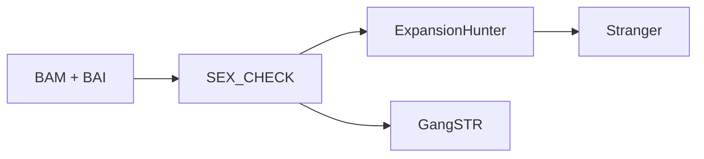

# Weird-little-features-nf

## Workflow description

Repeat expansion genotyping from short-read Illumina BAM files.

For each sample, the pipeline:

1. Resolves the sample's sex from the samplesheet if given, otherwise inferred from the BAM via ngs-bits `SampleGender`
2. Genotypes short tandem repeats with ExpansionHunter (catalog-based) and/or GangSTR (region-based), using the resolved sex where relevant
3. Annotates ExpansionHunter's calls with pathogenicity/disease thresholds using Stranger



## User guide

### Requirements

- [Nextflow](https://www.nextflow.io/docs/latest/index.html) `>=24`
- Singularity/Apptainer
- A reference genome FASTA with a `.fai` index alongside it
- An ExpansionHunter STR catalog `.json` 

### Quick start

```bash
nextflow run main.nf \
  --input samplesheet.csv \
  --ref /path/to/reference.fa \
  --catalog /path/to/variant_catalog.json \
  -profile singularity
```

### Samplesheet

CSV with the following columns:

| Column     | Required | Description |
|------------|----------|--------------|
| `sampleID` | yes      | Sample identifier, used to tag outputs |
| `bam`      | yes      | Path to the sample's BAM file |
| `sex`      | no       | `male`/`female` (also accepts `M`/`F`, `XX`/`XY`) |

```csv
sampleID,bam,sex
sample_01,/path/to/sample_01.bam,male
sample_02,/path/to/sample_02.bam,
```

**`sex` is optional per-sample.** Leave it blank (or omit values you don't know) and the pipeline will infer it via ngs-bits `SampleGender` before ExpansionHunter or GangSTR run. See [Sex resolution](#sex-resolution) below.

### Parameters

| Parameter | Required | Default | Description |
|---|---|---|---|
| `--input` | yes | – | Path to samplesheet CSV |
| `--ref` | yes | – | Reference genome FASTA (`.fai` must exist alongside it) |
| `--catalog` | yes | – | ExpansionHunter variant catalog (JSON). Also used by Stranger for annotation, so it must match the ExpansionHunter build (see [Additional notes](#additional-notes)) |
| `--ref_str` | no | not set | GangSTR STR region file (BED/TSV, uncompressed). GangSTR is skipped if this isn't provided |
| `--sexcheck_method` | no | `xy` | Method passed to ngs-bits `SampleGender` for samples with no usable `sex` in the samplesheet. One of `xy`, `hetx`, `cnv` — see the [ngs-bits documentation](https://github.com/imgag/ngs-bits) |
| `--outdir` | no | `results` | Output directory |

Run `nextflow run main.nf --help` to see this at the command line.

### Sex resolution

ExpansionHunter's genotyping of X-linked repeats depends on sample sex, so every sample needs one resolved *before* any repeat expansion module runs:

- If the samplesheet provides a recognised value (`male`/`female`, `M`/`F`, `XX`/`XY`), it's used directly.
- Otherwise, `ngs-bits SampleGender` is run on the BAM to infer it from X/Y coverage.
- If detection is inconclusive, the sample defaults to `male` (ExpansionHunter's own default) and a warning is logged.

The resolved sex is passed to ExpansionHunter as `--sex`. GangSTR and Stranger do not currently take sex into account (see [Additional notes](#additional-notes)).

### Outputs

```
<outdir>/
├── repeat_expansions/
│   ├── expansionhunter/<sampleID>/   # *.eh.vcf, *.eh.json
│   ├── gangstr/<sampleID>/           # *.gangstr.vcf   (only if --ref_str is set)
│   └── stranger/<sampleID>/          # *_stranger.vcf.gz + .tbi
├── runInfo/                          # DAG, execution report, timeline
└── run_info/                         # trace file
```

## Component tools

| Tool | Version | Purpose |
|---|---|---|
| [ngs-bits `SampleGender`](https://github.com/imgag/ngs-bits) | 2025_12 | Infer sample sex from BAM coverage when not given in the samplesheet |
| [ExpansionHunter](https://github.com/Illumina/ExpansionHunter) | 5.0.0 | Catalog-based STR genotyping |
| [GangSTR](https://github.com/gymreklab/GangSTR) | 2.5.0 | Region-based STR genotyping |
| [Stranger](https://github.com/Clinical-Genomics/stranger) | 0.9.1 | STR pathogenicity/disease-threshold annotation |

All tools run via Singularity/Apptainer containers — no local installation is required. Container images are cached under `singularity/` in the pipeline directory (gitignored).

## Additional notes

- **Catalog build consistency.** `--catalog` is passed to both ExpansionHunter and Stranger, so the same repeat definitions are used for genotyping and annotation. Make sure it matches the genome build given via `--ref` (e.g. a GRCh38 catalog with a GRCh38 reference) — Stranger ships a GRCh37 default that this pipeline deliberately overrides for that reason.
- **GangSTR region file must be uncompressed.** `--ref_str` should point at a plain BED/TSV, not a `.gz`.
- **No standard catalogs exist for non-human species.** `--catalog` and `--ref_str` are both optional; if the standard human resources don't apply to your samples, supply a custom catalog/region file, or the corresponding tool will be skipped for all samples (logged as a warning, not an error).
- **GangSTR and Stranger don't currently use sex.** GangSTR does have a `--samp-sex` option for X/Y-aware genotyping, and Stranger has no sex-related option — see [ExpansionHunter's use of sex](#sex-resolution) if you're deciding whether to extend this further.

## Help / FAQ / Troubleshooting

## License(s)

Pipeline code: [GNU GPLv3](LICENSE).

Component tools are distributed under their own licenses — see each tool's repository linked in [Component tools](#component-tools).

## Acknowledgements/citations/credits

Developed by Georgie Samaha, Sydney Informatics Hub, University of Sydney.

